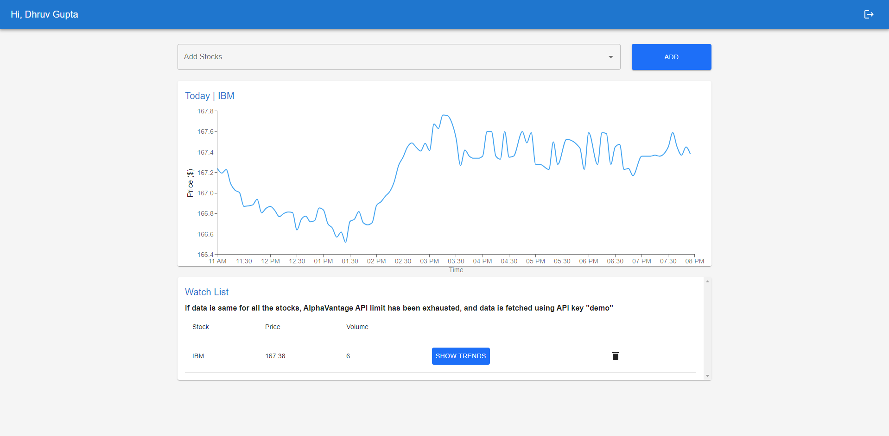

# Stockify - Stock Monitoring Platform [Demo Link](https://task-blendnet-ai.vercel.app/)

## Backend
### Authentication
The app supports two types of authentication, email based and Google Oauth based authentication. 

I have used Node.js as javascript runtime environment and Express.js as the backend framework. I have used MongoDB as the database, JWT for token based authentication, passport.js for Google OAuth 2.0 authentication and nodemailer for sending emails.

- For email based authentication, I have implemented two factor authentication that sends an OTP to the user's email for verification using nodemailer..
- I have also implemented real time email notifications for all account activities, including login events, password modifications etc.
- For the Google-based authentication, I have used Google OAuth 2.0 to authenticate users, whenever a google based authentication is triggered, the API redirects the user to the google login page and after successful login, the user is redirected back to the specified URL given to the API in the initial request with an authToken as a query parameter. This authToken can be interchanged with backend to obtain user details and perform further actions.

- Available API endpoints:
    1. ``` POST /auth/signup/email/verify - Signup Route: OTP verification and account creation ```
    2. ``` POST /auth/signup/email - Signup Route: Send OTP for email verification ```
    3. ``` POST /auth/signin - Signin Route: Login with email and password ```
    4. ``` POST /auth/verifyuser - Route -3 Obtaining details from jwt token ```
    5. ``` POST /auth/forgot - Forgot Password Route: Send OTP for password reset ```
    6. ``` POST /auth/forgot/verify - Forgot Password Route: Verify OTP and reset password ```
    6. ``` GET /auth/google - To redirect to google login page ```

- For detailed documentation, refer to the [https://github.com/MR-DHRUV/Authify-The-Authentication-API](https://github.com/MR-DHRUV/Authify-The-Authentication-API)


### Stock Monitoring
Simple CRUD operations are implemented for stock monitoring. 

- Available API endpoints:
    1. ``` GET /watchlist - Get watchlist ```
    2. ``` POST /watchlist/add - Add to watchlist ```
    3. ``` POST /watchlist/remove - Remove from watchlist ```

## Frontend
The frontend is built using React.js, Typescript and Material UI. It is a simple web application that allows users to monitor their stocks, view trends and maintain a watchlist.

<strong>
Please note that Alpha Vantage API only provides 25 api calls each day, so it may be the case that the API is exhausted and as a result,  you will see same data for all stocks.
</strong>


